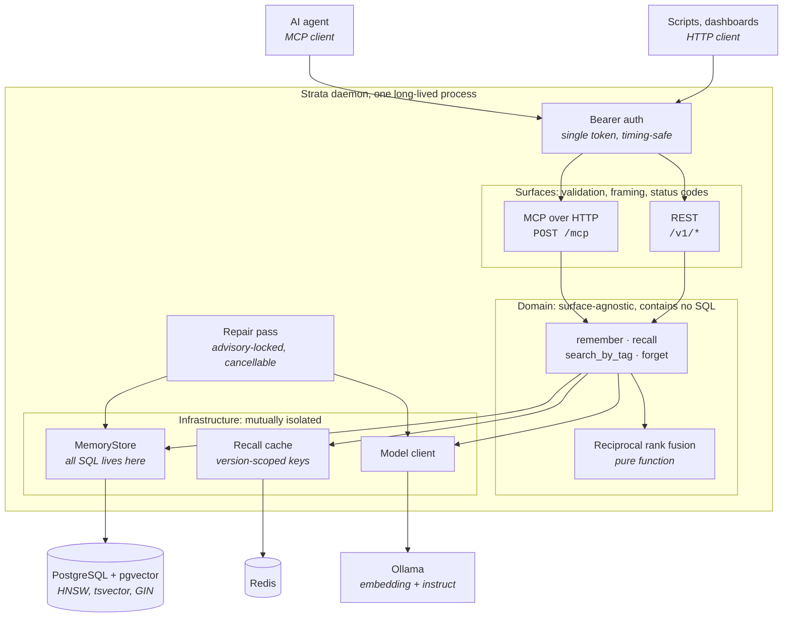

# Strata

A local-first memory layer for AI agents. Strata compresses what an agent tells it,
indexes the result with hybrid search, and serves it back over MCP and HTTP. Every
model call and every byte of storage stays on hardware you own.

## The problem

AI coding agents forget. Close a session and the architecture you explained, the
decision you argued through, and the bug you finally cornered are gone. The next
session starts by re-explaining all of it.

The usual answers are unsatisfying in opposite directions. Dumping raw transcripts
into a vector store is cheap to write and painful to read back: retrieval returns
fragments of conversation, not answers. Hosted memory services read well but hand
your project's internals to somebody else's infrastructure, and bill per token to do
it.

Strata takes a third position. Memory is compressed into durable facts on the way in,
and reasoned over on the way out, by two small models running on your own machine.

## How it works

Two local models, served by Ollama, do the work. An embedding model turns text into
vectors for similarity search. A small instruct model compresses raw input into a
summary plus tags on write, and composes retrieved memories into a single answer on
read.

### Writing a memory

```
content ──> hash and dedupe ──> INSERT (committed) ──> compress ──> embed ──> UPDATE
                                      │                    │          │
                                   fails loud          degrades   degrades
```

The insert commits before any model is called. This ordering is the single most
important rule in the system: a memory that reached Strata is never lost because a
model was slow, unreachable, or unpulled. If compression or embedding fails, the row
stays durable at `status: 'raw'`, the caller is told so, and a background repair pass
picks it up later and finishes the job.

The repair pass runs on an interval, claims a Postgres advisory lock so only one
process ever works the backlog, and distinguishes two kinds of failure. Content that
defeats the model counts against a per row attempt cap with exponential backoff. A
transport failure, meaning Ollama is down or too slow, counts nothing at all and stops
the pass, because every remaining row would fail identically and charging them for one
outage would write off the corpus in a handful of passes.

### Reading a memory

```
query ──> cache ──┬──> lexical search  ─┐
                  │                     ├──> reciprocal rank fusion ──> synthesis
                  └──> semantic search ─┘
```

Stages run cheapest first, and the two search paths run concurrently rather than in
sequence. Lexical search is Postgres full text search, which finds exact identifiers
and error strings. Semantic search is pgvector cosine similarity over an HNSW index,
which finds meaning when the wording has nothing in common. Reciprocal rank fusion
merges the two ranked lists without needing their scores to be comparable, which they
are not.

Only the fused shortlist reaches the instruct model, never the whole store, so read
latency stays bounded as memory grows.

Failure is graded, not binary:

| Component | Down | Result |
| --- | --- | --- |
| Redis | Cache miss every time | Slower, correct |
| Ollama | No query vector, no synthesis | Lexical results, no answer, warning logged |
| One search path | Fusion over the survivor | Fewer results, warning logged |
| Postgres | Nothing can be served | The call fails, loudly |

A degraded result is never written to the cache. The failure that rule prevents is
specific: an Ollama outage plus a keyword-poor query produces zero results and an
authored "nothing matched", which cached under a live corpus version would keep
telling the agent its memory is empty long after the model came back.

## Architecture

One process serves both surfaces. MCP and HTTP are thin: they own validation, framing,
and status codes, and nothing else. Everything either of them can do lives in the
domain layer below, which is why the two cannot drift apart.



MCP runs over Streamable HTTP with a fresh protocol server per request. Sharing one
server or transport across requests routes one client's response into another client's
connection, so the SDK throws rather than allow it, and Strata builds a new pair each
time. A single long-lived process is what makes one HTTP listener, one MCP endpoint,
and one repair schedule coherent together; the alternative, spawning a process per
client session, gives you N repair passes over one backlog when clients are connected
and none at all when they are not.

## Engineering approach

The interesting part of this project is not the retrieval pipeline. It is that the
rules the pipeline depends on are enforced by tooling rather than remembered by
whoever is editing.

**Module seams are lint rules, not conventions.** The three infrastructure clients,
Postgres, Redis, and Ollama, may not import one another. The domain layer may not
import a surface. Neither surface may import the other. A violation of any of these
compiles cleanly and passes every test; only the architecture rots. So each boundary is
a lint rule, and a shell script probes all of them 49 times over, planting imports that
must be rejected and imports that must be allowed, failing if the linter gets either
wrong.

**One contract, tested twice.** The storage interface has a single conformance suite
of behavioural assertions. It runs unmodified against both the in-memory fake used by
fast tests and real Postgres in a container. A fake that has drifted from the database
it stands in for is worse than no fake, because it makes the suite confidently wrong.

**A guard counts only once it has been seen failing.** Every check added to this
codebase is first verified by deliberately breaking the thing it protects and watching
it go red. A test that passes against broken code is not a test. This caught a real
case where a passing suite was measuring the wrong invariant.

**Errors are typed, wrapped, and never swallowed.** Every external call is bounded by a
timeout and converted into a tagged error with the original preserved as its cause. The
mapping from error code to HTTP status is an exhaustive record rather than a switch
with a default, so adding a new failure mode fails to compile until somebody chooses
its status, instead of silently becoming a 500.

**Retrieval quality is measured, not argued about.** `eval/` holds a purpose-built
corpus and a harness that scores four retrieval strategies against it. Constants like
the fusion dampener and the HNSW search width are treated as unsettled until the
harness has compared them. See [`eval/README.md`](eval/README.md).

More detail lives beside the code it describes:

- [`src/README.md`](src/README.md), module map, dependency direction, and error model
- [`tests/README.md`](tests/README.md), the testing strategy and what each layer proves
- [`eval/README.md`](eval/README.md), the retrieval yardstick and what it has found

## Getting started

Requires Node 20 or newer, pnpm, and Docker.

### Development

```bash
pnpm install
docker compose up -d                 # Postgres with pgvector, and Redis
cp .env.example .env
pnpm check                           # typecheck, lint, and the full test suite
```

`docker compose up` starts the substrate only, on deliberately non-default ports so a
locally installed Postgres cannot quietly stand in for the container. The test suite
runs without any container: files that need one skip themselves. To run everything
including those, use `./scripts/integration.sh`, which brings the stack up, runs the
suite serialized, and tears down from a trap on the way out.

### Production

The production stack runs Postgres, Redis, Ollama, and Strata together. Models are
pulled as an explicit step rather than a boot dependency, because a multi-gigabyte
download that reports success while still running is not something to gate a deployment
on.

```bash
cp .env.example .env && $EDITOR .env      # POSTGRES_PASSWORD and MCP_AUTH_TOKEN
docker compose -f docker-compose.prod.yml up -d --wait
docker compose -f docker-compose.prod.yml run --rm ollama-pull
docker compose -f docker-compose.prod.yml --profile app up -d --build --wait
```

The daemon binds loopback by default and publishes to `127.0.0.1` unless `BIND_ADDR`
says otherwise. That default is deliberate. Docker's firewall rules are evaluated
before the chain `ufw` writes to, so a published port is not closed by the rule an
operator believes closes it, and Strata serves plain HTTP, so a bearer token crosses
the wire in the clear. Point `BIND_ADDR` at a private overlay address such as a
Tailscale or WireGuard interface, and let the overlay carry encryption and identity.

### Configuration

| Variable | Default | Purpose |
| --- | --- | --- |
| `POSTGRES_URL` | required | Connection string for the memory store |
| `REDIS_URL` | required | Connection string for the recall cache |
| `OLLAMA_URL` | required | Absolute URL of the model server |
| `EMBEDDING_MODEL` | required | Model used for vectors |
| `INSTRUCT_MODEL` | required | Model used for compression and synthesis |
| `MCP_AUTH_TOKEN` | required for HTTP | Bearer token, minimum 32 characters |
| `STRATA_TRANSPORT` | `http` | `http` for the daemon, `stdio` for local development |
| `HTTP_HOST` | `127.0.0.1` | Bind address inside the process |
| `HTTP_PORT` | `8080` | Listen port |
| `OLLAMA_TIMEOUT_MS` | `60000` | Ceiling on a single model call |
| `COMPACTION_ENABLED` | `false` | Reserved, off by default |

A malformed environment throws at startup rather than on the first tool call, where the
failure would reach the agent as a confusing tool error instead of an obvious boot
failure.

## Interface

### MCP tools

Four, deliberately. Every additional tool measurably dilutes an agent's ability to pick
the right one, and `remember` and `recall` are the two that matter.

| Tool | Purpose |
| --- | --- |
| `remember` | Store content. Returns the id, summary, tags, and whether compression succeeded |
| `recall` | Hybrid search with optional synthesis. Returns ranked results and an answer |
| `search_by_tag` | Exact tag lookup. Makes no model calls at all |
| `forget` | Soft delete by id. Returns whether anything was deleted |

Every field of every tool carries a description on the wire, not just the tools
themselves. For an agent-facing server the schema is the entire specification: a field
documented only in a comment beside its definition is a field the caller will guess at.
A test walks the generated schemas and fails if any field, including the ones nested
inside result arrays, has nothing to say for itself.

### HTTP routes

The same domain logic, for scripts and dashboards that do not speak MCP. Versioned
under `/v1`, because a script depending on a response shape makes that shape an API.

```
GET    /v1/health
POST   /v1/memories
GET    /v1/memories                 tag search
DELETE /v1/memories/:id
POST   /v1/memories/:id/restore
POST   /v1/recall
```

Deletion is soft, so restore exists and is HTTP only: an agent that could undo its own
deletions would be able to work around a user's decision to remove something.

## Data model

A single migration owns the whole schema. Late schema changes force rewrites of tools
that are already finished, so the columns that later features need ship from the start,
unused, rather than arriving as a migration against live data.

Memories carry raw content, a compressed summary, tags, an embedding, a status, session
provenance, and usage counters. Deletion sets a timestamp and supersession sets a
pointer to the replacing row; nothing is ever removed. Every read path filters both, so
a forgotten memory cannot resurface through a search path that forgot to check.

pgvector 0.8 or newer is a boot-time contract, verified by a migration rather than
assumed from the image tag, because pinning an image cannot upgrade an extension inside
a volume that already exists.

## Stack

TypeScript in strict mode, Node 20, Hono, PostgreSQL with pgvector, Redis, and Ollama.
No `any` at any module boundary. Validation happens once at each edge with Zod, and
after that the code trusts its types.

## Status

Early stage and under active construction. Interfaces, schema, and tooling are still
taking shape, and the storage and transport layers are further along than the retrieval
tuning that sits on top of them.

## License

MIT. See [LICENSE](./LICENSE).
