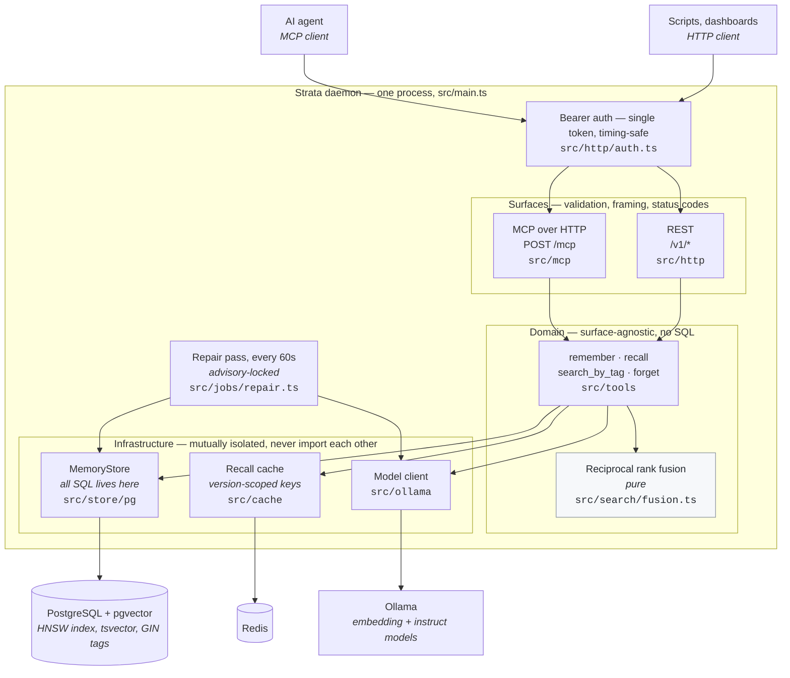

# Strata

Local-first memory layer for AI agents. Compresses context with a local LLM, indexes it with hybrid search, and serves it over MCP.

## What this is

AI coding agents lose context between sessions. Every new session re-explains decisions, architecture, and debugging that already happened. Most memory solutions either dump raw transcripts, which are cheap to write but hard to read back, or hand your data to a hosted third party.

Strata compresses memory on write and synthesizes it on read, and it runs entirely on hardware you own. No data leaves your network, and there is no API cost for embeddings or inference.

## How it works

Two local models, run through Ollama, do the work:

- An embedding model turns memory into searchable vectors
- A small instruct model compresses raw input into durable facts on write, and synthesizes a coherent answer from retrieved memories on read

Reads run through a staged retrieval pipeline, cheapest first:

1. Exact match against cache
2. Lexical search using Postgres full text search
3. Semantic search using vector similarity
4. Fusion of the lexical and semantic results
5. Synthesis, where the local LLM reasons over the fused results and returns one coherent answer

The LLM only ever sees a short, fused shortlist rather than the entire store, so response time stays bounded as memory grows.

## Architecture

One long-lived process serves both surfaces. MCP and REST are thin: they own validation, framing, and status codes, and nothing else. Everything either of them can do lives in the domain layer below, which is why the two cannot drift.

**The rules the diagram encodes**, all lint-enforced rather than remembered:

- **The domain layer imports no surface**, and neither surface imports the other. `src/main.ts` is the only file allowed to name every layer — it is the composition root, and assembling them is its job.
- **The three infrastructure clients never import each other.** Any one of Postgres, Redis, or Ollama can be replaced without touching the other two. Composition happens one level up.
- **The store receives a query vector, never an embedder.** Letting it reach for Ollama so a semantic search could embed its own query is how that isolation collapses.
- **A write is durable before any model call.** Compression and embedding happen after the insert commits, so a model failure degrades a memory to `status:'raw'` rather than losing it; the repair pass drains that backlog.
- **Reads degrade rather than fail.** Redis down costs latency, Ollama down costs synthesis. Only Postgres is load-bearing.

## Design principles

- **Local first.** Every model, every byte of storage, stays on hardware you control.
- **Compressed, not raw.** Memory is distilled facts, not transcripts, so the store stays useful as it grows instead of becoming a junk drawer.
- **Cheap before expensive.** Search only escalates to slower, smarter stages when cheaper ones are not enough.
- **MCP native.** Any MCP compatible agent can read and write memory without custom integration work.

## Stack

PostgreSQL with pgvector, Redis, Ollama, and a Node.js and TypeScript MCP server built on Hono.

## Status

Early stage. Interfaces, schema, and tooling are still taking shape.

## License

MIT. See [LICENSE](./LICENSE).
